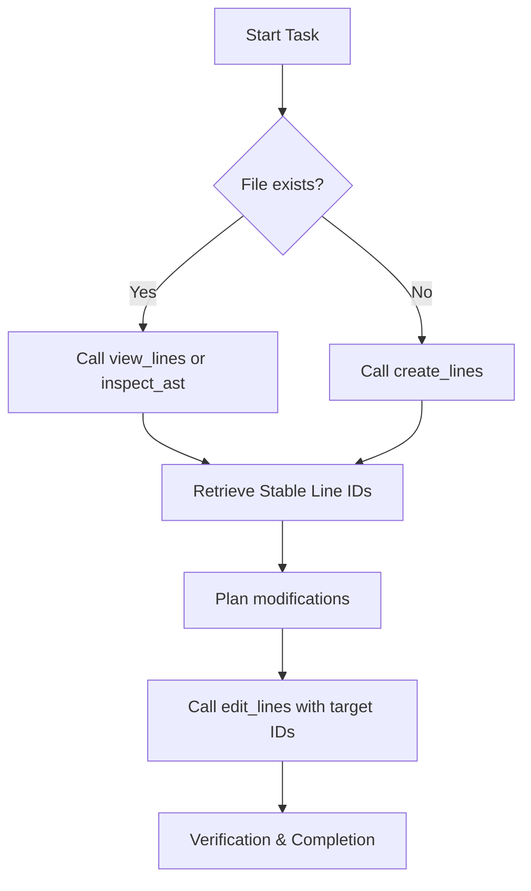

# ast-editor

`ast-editor` is an agent-native tool suite designed to enable AI coding assistants to view, inspect, and modify codebases with absolute precision and safety. By combining Tree-sitter AST queries with a session-based transactional line editor, it eliminates common editing failure modes like line-sliding hallucinations and duplicate match corruption.

---

## 🌟 Core Value Proposition

When agentic workflows attempt to edit code using traditional string-replacement tools (like `replace_file_content`), they suffer from:
1. **Line-sliding Hallucinations**: Modifying a block of code shifts the line numbers, causing subsequent edits in the same session to target the wrong lines.
2. **Brittle Matching**: Find-and-replace rules fail or match duplicate blocks when editing common or generic lines.
3. **Token Waste**: Dumping thousands of lines to edit a small function wastes context windows and tokens.

`ast-editor` solves this by introducing:
*   **Shift-Invariant targeting**: A session-cached database maps every line to a stable sequence ID and content hash (`[id, n, content]`). Line IDs remain valid even when surrounding lines are added, deleted, or shifted.
*   **Safe Paragraph/Block-level Edits**: Instead of writing complex regex, agents edit code using target anchors with transactional rollbacks.
*   **Multi-layered Safety Guards**: Automatic 800-line limits, 45KB response size caps, and 2048-character line truncations prevent token exhaustion.

---

## 📦 Install

```bash
just install     # the binary, its grammars, and the skill
just --list      # the other tasks
```

Under `~/.agents` by default:

| | |
|---|---|
| `bin/ast-editor` | the binary |
| `share/ast-editor/wasm/` | tree-sitter grammars |
| `skills/ast-editor/SKILL.md` | the skill document |

The skill documents are embedded in the binary, so what `install-skill` writes
is what that binary carries. Only the hub is installed: it reaches its
references by naming `ast-editor skill <topic>` rather than a path, which works
in a terminal and in an installed tree alike. `ast-editor --help` lists the
topics.

`AST_EDITOR_PREFIX` chooses a different prefix, and `install-bin` /
`install-skill` install one half. The binary finds its grammars relative to
itself, so nothing needs to be exported; `AST_EDITOR_WASM_DIR` overrides that
for an unusual layout. `<prefix>/bin` does need to be on `PATH`, since the
skill document calls the command by name.

---

## 🚀 Two Ways to Call It

The tools are the same either way; only the envelope differs.

**Command line** — one tool, one call, arguments as the same JSON object the
MCP call takes:

```bash
ast-editor view_lines '{"filepath":"/path/to/file.rs","query":"fn main"}'
ast-editor edit_lines '{"filepath":"/path/to/file.rs","apply":"p1f"}'
ast-editor --version
ast-editor --help
```

Editing has a second form that takes a script on stdin, so code needs no
escaping at all — see [the format](docs/specs/edit-script-spec.md):

```bash
ast-editor edit src/config.rs <<'EOF'
replace 2#0759 ```
    let msg = format!("can't parse {:?}: {}", path, err);
```
delete 7c#aabb
EOF
```

`view_lines` takes a `query` and `inspect_ast` matches carry `start_id` /
`end_id`, so finding a line by content or by structure already yields the IDs
that edit it — no line numbers, and no `grep` pass first.

**MCP server** — for clients that expect one. It has to be asked for, because
a client mounting this over MCP keeps every tool schema in its context for the
whole conversation:

```bash
ast-editor mcp                    # serve JSON-RPC over stdin
just install-mcp ~/.claude.json   # register it in a client config
```

The tool's own output goes to stdout with no JSON-RPC wrapper, so it pipes:

```bash
ast-editor edit_lines '{"filepath":"...","edits":[...],"dry_run":true}' | jq -r .preview_id
```

Failures print to stderr and exit non-zero. Because the arguments *are* the
tool schema, there is no second interface to keep in step with it.

---

## 🛠️ Tool Suite

### 1. `create_lines`
Creates a brand-new file with initial content, JIT-initializes its database editing session, and returns the line list with unique line IDs in a single atomic step.
*   **Safety**: Fails with `FILE_ALREADY_EXISTS` if the target path is not empty.

#### Input Schema
```json
{
  "properties": {
    "content": {
      "description": "Initial text content of the file.",
      "type": "string"
    },
    "filepath": {
      "description": "Absolute path to the file.",
      "type": "string"
    },
    "return_ids": {
      "default": false,
      "description": "If true, returns the flat array of generated Line IDs. Set to false to omit IDs and save tokens.",
      "type": "boolean"
    }
  },
  "required": [
    "filepath",
    "content"
  ],
  "type": "object"
}
```

#### Usage Examples

##### Default Example (`return_ids = false`)
###### Input
```json
{
  "content": "fn main() {\n    let x = 42;\n}\n",
  "filepath": "/path/to/project/create_default.rs",
  "return_ids": false
}
```

###### Output
```json
{
  "message": "File successfully created and line editing session initialized.",
  "status": "success",
  "total_bytes": 30,
  "total_lines": 3
}
```

##### Example with Line IDs (`return_ids = true`)
###### Input
```json
{
  "content": "fn main() {\n    let x = 42;\n}\n",
  "filepath": "/path/to/project/create_ids.rs",
  "return_ids": true
}
```

###### Output
```json
{
  "ids": [
    "1#77cf", "2#bcb4", "3#c2b7"
  ],
  "message": "File successfully created and line editing session initialized.",
  "status": "success",
  "total_bytes": 30,
  "total_lines": 3
}
```

#### 🛡️ Catastrophic Truncation Prevention / Why not `write_lines`

Lazy agents often try to rewrite whole files to apply simple changes. When a network hiccup or token limit is reached mid-stream, it causes catastrophic mid-file truncation and permanent data loss.

To prevent this, `create_lines` intentionally blocks overwriting (`FILE_ALREADY_EXISTS`) to act as a safety guardrail forcing surgical line-level edits (`edit_lines`) for existing files.

We do not rename `create_lines` to `write_lines` because the word "write" suggests overwriting or rewriting existing content, whereas `create_lines` is explicitly designed as a one-time creation/initialization operation.

### 2. `view_lines`
Retrieves a range of lines for any text file along with their persistent line IDs.
*   **Capping**: Range length is capped at 800 lines max per call.
*   **Capacity Limit**: Cumulative returned text is capped at 45,000 bytes.
*   **Truncation**: Lines exceeding 2048 characters are truncated in the view and given a `#TRUNC` ID suffix.

#### Input Schema
```json
{
  "properties": {
    "context_lines": {
      "description": "Optional number of surrounding context lines to return around query matches. Defaults to 5.",
      "type": "integer"
    },
    "end_line": {
      "description": "1-indexed ending line number (inclusive)",
      "type": "integer"
    },
    "filepath": {
      "description": "Absolute path to the target file",
      "type": "string"
    },
    "only_ids": {
      "description": "If true, only returns Line IDs and line numbers, omitting text content.",
      "type": "boolean"
    },
    "query": {
      "description": "Optional search term to filter lines matching this keyword.",
      "type": "string"
    },
    "start_line": {
      "description": "1-indexed starting line number (inclusive)",
      "type": "integer"
    }
  },
  "required": [
    "filepath"
  ],
  "type": "object"
}
```

#### Usage Examples

##### Default Example (`only_ids = false`)
###### Input
```json
{
  "end_line": 3,
  "filepath": "/path/to/project/create_ids.rs",
  "only_ids": false,
  "start_line": 1
}
```

###### Output
```rust
1: fn main() {
2:     let x = 42;
3: }
```

```json
{
  "enclosing_contexts": [],
  "ids": [["1#77cf",1],["2#bcb4",2],["3#c2b7",3]],
  "showing_end": 3,
  "showing_start": 1,
  "tip": "Edit these lines by calling 'edit_lines' with the line IDs (e.g. 1a#f8c9) shown above.",
  "total_bytes": 30,
  "total_lines": 3
}
```

##### Example with IDs Only (`only_ids = true`)
###### Input
```json
{
  "end_line": 3,
  "filepath": "/path/to/project/create_ids.rs",
  "only_ids": true,
  "start_line": 1
}
```

###### Output
```json
{
  "enclosing_contexts": [],
  "ids": [["1#77cf",1],["2#bcb4",2],["3#c2b7",3]],
  "showing_end": 3,
  "showing_start": 1,
  "tip": "Edit these lines by calling 'edit_lines' with the line IDs (e.g. 1a#f8c9) shown above.",
  "total_bytes": 30,
  "total_lines": 3
}
```

### 3. `edit_lines`
Applies a transactional batch of operations to lines using their unique IDs.
*   **Supported Operations**: `replace`, `replace_range`, `replace_substring`, `insert_before`, `insert_after`, `delete`, `move`.
*   **Syntax Validation**: Performs AST parsing validation for supported programming, configuration, and shell script languages, and Comrak-based structural validation for Markdown (`.md`, `.markdown` extensions) to verify elements like unclosed code fences. Changes are automatically rolled back if syntax errors are introduced.
*   **Safety**: Reject edits to `#TRUNC` lines with a `LINE_TOO_LONG_ERROR` recommending beautifiers (prettier, black, cargo fmt) to prevent data loss.

#### Input Schema
```json
{
  "properties": {
    "apply": {
      "description": "A preview_id from an earlier dry_run, e.g. 'p1f'. Applies the batch that preview validated and returns its modified_ids. Supply 'filepath' with it; 'edits' is not needed and is ignored. A preview id is single-use, and is refused once the file has changed under it.",
      "type": "string"
    },
    "dry_run": {
      "default": false,
      "description": "If true, returns the unified diff and syntax validation result the edits would produce, without writing to disk or assigning line IDs. When the result is syntactically valid the response also carries a preview_id; pass it back as 'apply' to commit that exact batch without resending it.",
      "type": "boolean"
    },
    "edits": {
      "items": {
        "properties": {
          "content": {
            "description": "The new content to insert or replace with. Omitted/ignored for delete, move.",
            "type": "string"
          },
          "dest_target_id": {
            "description": "Optional destination target line ID (e.g. 10#e9c4). Required for move operations with 'before' or 'after' move_position.",
            "type": "string"
          },
          "end_target_id": {
            "description": "Optional ending target line ID for block range (e.g. 5#7f1c). Required for replace_range, optional for move.",
            "type": "string"
          },
          "move_position": {
            "description": "Optional relative position for move operations ('before', 'after', 'prepend', 'append').",
            "enum": [
              "before",
              "after",
              "prepend",
              "append"
            ],
            "type": "string"
          },
          "occurrence": {
            "description": "Optional 1-indexed occurrence count of the pattern (default: 1) for replace_substring.",
            "type": "integer"
          },
          "op": {
            "description": "The edit operation to perform.",
            "enum": [
              "replace",
              "insert_after",
              "insert_before",
              "delete",
              "replace_range",
              "move",
              "replace_substring"
            ],
            "type": "string"
          },
          "pattern": {
            "description": "The substring pattern to find. Required for replace_substring.",
            "type": "string"
          },
          "replacement": {
            "description": "The replacement string. Required for replace_substring.",
            "type": "string"
          },
          "target_id": {
            "description": "Optional target line ID (e.g. 1#a5c7). Required for replace, delete, replace_range, move, replace_substring. Optional/omitted for insert_before (prepends) and insert_after (appends).",
            "type": "string"
          }
        },
        "required": [
          "op"
        ],
        "type": "object"
      },
      "type": "array"
    },
    "filepath": {
      "description": "Absolute path to the file to modify",
      "type": "string"
    },
    "strict_validation": {
      "default": false,
      "description": "If true, rolls back edits on syntax or parser error. If false, saves changes anyway and returns warnings/errors.",
      "type": "boolean"
    }
  },
  "required": [
    "filepath"
  ],
  "type": "object"
}
```

#### Usage Examples

##### Compact Example
###### Input
```json
{
  "edits": [
    {
      "content": "    let y = 200;",
      "op": "insert_after",
      "target_id": "2#bcb4"
    },
    {
      "content": "    let x = 100;",
      "op": "replace",
      "target_id": "2#bcb4"
    },
    {
      "op": "delete",
      "target_id": "3#c2b7"
    }
  ],
  "filepath": "/path/to/project/create_ids.rs"
}
```

###### Output
```json
{
  "status": "success",
  "modified_ids": [
    "4#b7a3", "2#9639", "4#b7a3"
  ]
}
```

### 4. `inspect_ast`
Queries a file's structure using Tree-sitter S-expression query patterns or templates (standard templates: `functions`, `classes`, `imports` across Python, Rust, Go, JS, TS, TSX, Java, C, and C++, with Bash supporting `functions`; specialized templates: Rust `traits` & `impls`, Go `structs` & `interfaces`, and C/C++ `macros`; Markdown templates: `headings`, `headers`, `codeblocks`, `code_blocks`, `links`, `tables`, `lists`), returning target line ranges and definitions.

### 5. `dump_ast`
Dumps the complete AST syntax tree of a file as S-expression text up to a certain depth.

---

## 🌐 Supported Languages & Formats

`ast-editor` supports full AST-based inspection and syntax validation for:
*   **Python** (`.py`)
*   **JavaScript / TypeScript / TSX** (`.js`, `.jsx`, `.ts`, `.tsx`)
*   **Go** (`.go`)
*   **Rust** (`.rs`)
*   **Java** (`.java`)
*   **C / C++** (`.c`, `.h`, `.cpp`, `.cc`, `.cxx`)
*   **Lua** (`.lua`)
*   **HTML** (`.html`, `.htm`)
*   **JSON** (`.json`)
*   **YAML** (`.yaml`, `.yml`)
*   **TOML** (`.toml`)
*   **Swift** (`.swift`)
*   **Markdown** (`.md`, `.markdown`)
*   **Shell Scripts (POSIX shell, Bash, Zsh, Ksh)** (`.sh`, `.bash`, `.zsh`, `.ksh`)
*   **Nix** (`.nix`)

---

## 🔄 Recommended Workflow (Agent Lifecycle)



### Long Line Handling
If a line length exceeds 2048 characters and triggers a `LINE_TOO_LONG_ERROR`, run a local formatter to break it into multiple lines before editing:
$$\text{Prettier / Black / Cargo fmt} \rightarrow \text{view\_lines} \rightarrow \text{edit\_lines}$$

---

## ⚙️ Build & Setup

### Requirements
*   Rust 1.74.1+
*   Cargo

### Compilation
```bash
cargo build --release
```
The compiled release binary is located at `target/release/ast-editor`.
