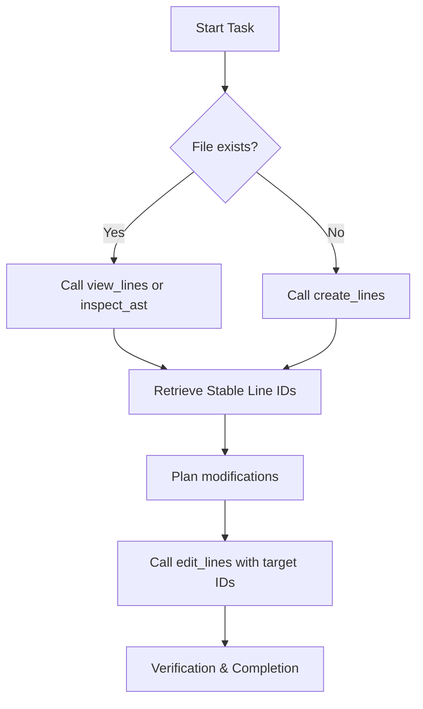

# ast-editor

`ast-editor` is an agent-native tool suite designed to enable AI coding assistants to view, inspect, and modify codebases with absolute precision and safety. By combining Tree-sitter AST queries with a session-based transactional line editor, it eliminates common editing failure modes like line-sliding hallucinations and duplicate match corruption.

---

## 🌟 Core Value Proposition

When agentic workflows attempt to edit code using traditional string-replacement tools (like `replace_file_content`), they suffer from:
1. **Line-sliding Hallucinations**: Modifying a block of code shifts the line numbers, causing subsequent edits in the same session to target the wrong lines.
2. **Brittle Matching**: Find-and-replace rules fail or match duplicate blocks when editing common or generic lines.
3. **Token Waste**: Dumping thousands of lines to edit a small function wastes context windows and tokens.

`ast-editor` solves this by introducing:
*   **Shift-Invariant targeting**: A session-cached database maps every line to a stable sequence ID and content hash (`[id, n, content]`). Line IDs remain valid even when surrounding lines are added, deleted, or shifted.
*   **Safe Paragraph/Block-level Edits**: Instead of writing complex regex, agents edit code using target anchors with transactional rollbacks.
*   **Multi-layered Safety Guards**: Automatic 800-line limits, 45KB response size caps, and 2048-character line truncations prevent token exhaustion.

---

## 🛠️ MCP Tool Suite

### 1. `create_lines`
Creates a brand-new file with initial content, JIT-initializes its database editing session, and returns the line list with unique line IDs in a single atomic step.
*   **Safety**: Fails with `FILE_ALREADY_EXISTS` if the target path is not empty.

#### Input Schema
```json
{
  "properties": {
    "content": {
      "description": "Initial text content of the file.",
      "type": "string"
    },
    "filepath": {
      "description": "Absolute path to the file.",
      "type": "string"
    },
    "return_ids": {
      "default": false,
      "description": "If true, returns the flat array of generated Line IDs. Set to false to omit IDs and save tokens.",
      "type": "boolean"
    }
  },
  "required": [
    "filepath",
    "content"
  ],
  "type": "object"
}
```

#### Usage Examples

##### Default Example (`return_ids = false`)
###### Input
```json
{
  "content": "fn main() {\n    let x = 42;\n}\n",
  "filepath": "/path/to/project/create_default.rs",
  "return_ids": false
}
```

###### Output
```json
{
  "message": "File successfully created and line editing session initialized.",
  "status": "success",
  "total_bytes": 30,
  "total_lines": 3
}
```

##### Example with Line IDs (`return_ids = true`)
###### Input
```json
{
  "content": "fn main() {\n    let x = 42;\n}\n",
  "filepath": "/path/to/project/create_ids.rs",
  "return_ids": true
}
```

###### Output
```json
{
  "ids": [
    "1#77cf",
    "2#bcb4",
    "3#c2b7"
  ],
  "message": "File successfully created and line editing session initialized.",
  "status": "success",
  "total_bytes": 30,
  "total_lines": 3
}
```

#### 🛡️ Catastrophic Truncation Prevention / Why not `write_lines`

Lazy agents often try to rewrite whole files to apply simple changes. When a network hiccup or token limit is reached mid-stream, it causes catastrophic mid-file truncation and permanent data loss.

To prevent this, `create_lines` intentionally blocks overwriting (`FILE_ALREADY_EXISTS`) to act as a safety guardrail forcing surgical line-level edits (`edit_lines`) for existing files.

We do not rename `create_lines` to `write_lines` because the word "write" suggests overwriting or rewriting existing content, whereas `create_lines` is explicitly designed as a one-time creation/initialization operation.

### 2. `view_lines`
Retrieves a range of lines for any text file along with their persistent line IDs.
*   **Capping**: Range length is capped at 800 lines max per call.
*   **Capacity Limit**: Cumulative returned text is capped at 45,000 bytes.
*   **Truncation**: Lines exceeding 2048 characters are truncated in the view and given a `#TRUNC` ID suffix.

#### Input Schema
```json
{
  "properties": {
    "end_line": {
      "description": "1-indexed ending line number (inclusive)",
      "type": "integer"
    },
    "filepath": {
      "description": "Absolute path to the target file",
      "type": "string"
    },
    "only_ids": {
      "description": "If true, only returns Line IDs and line numbers, omitting text content.",
      "type": "boolean"
    },
    "start_line": {
      "description": "1-indexed starting line number (inclusive)",
      "type": "integer"
    }
  },
  "required": [
    "filepath",
    "start_line",
    "end_line"
  ],
  "type": "object"
}
```

#### Usage Examples

##### Default Example (`only_ids = false`)
###### Input
```json
{
  "end_line": 3,
  "filepath": "/path/to/project/create_ids.rs",
  "only_ids": false,
  "start_line": 1
}
```

###### Output
```json
{
  "columns": ["id","n","content"],
  "lines": [
  ["1#77cf", 1, "fn main() {"],
  ["2#bcb4", 2, "    let x = 42;"],
  ["3#c2b7", 3, "}"]
  ],
  "showing_end": 3,
  "showing_start": 1,
  "tip": "Edit these lines by calling 'edit_lines' with the line IDs (e.g. 1a#f8c9) shown above.",
  "total_bytes": 30,
  "total_lines": 3
}
```

##### Example with IDs Only (`only_ids = true`)
###### Input
```json
{
  "end_line": 3,
  "filepath": "/path/to/project/create_ids.rs",
  "only_ids": true,
  "start_line": 1
}
```

###### Output
```json
{
  "columns": ["id","n"],
  "lines": [
  ["1#77cf", 1], ["2#bcb4", 2], ["3#c2b7", 3]
  ],
  "showing_end": 3,
  "showing_start": 1,
  "tip": "Edit these lines by calling 'edit_lines' with the line IDs (e.g. 1a#f8c9) shown above.",
  "total_bytes": 30,
  "total_lines": 3
}
```

### 3. `edit_lines`
Applies a transactional batch of operations to lines using their unique IDs.
*   **Supported Operations**: `insert_before`, `insert_after`, `update`, `delete`, `move`, `replace_range`.
*   **Syntax Validation**: Performs AST parsing validation for supported languages and automatically rolls back changes if syntax errors are introduced.
*   **Safety**: Reject edits to `#TRUNC` lines with a `LINE_TOO_LONG_ERROR` recommending beautifiers (prettier, black, cargo fmt) to prevent data loss.

#### Input Schema
```json
{
  "properties": {
    "edits": {
      "items": {
        "properties": {
          "content": {
            "description": "The new content to insert/update/replace. Omitted/ignored for delete, move.",
            "type": "string"
          },
          "dest_target_id": {
            "description": "Optional destination target line ID (e.g. 10#e9c4). Required for move operations with 'before' or 'after' move_position.",
            "type": "string"
          },
          "end_target_id": {
            "description": "Optional ending target line ID for block range (e.g. 5#7f1c). Required for replace_range, optional for move.",
            "type": "string"
          },
          "move_position": {
            "description": "Optional relative position for move operations ('before', 'after', 'prepend', 'append').",
            "enum": [
              "before",
              "after",
              "prepend",
              "append"
            ],
            "type": "string"
          },
          "op": {
            "description": "The edit operation to perform.",
            "enum": [
              "update",
              "insert_after",
              "insert_before",
              "delete",
              "replace_range",
              "move"
            ],
            "type": "string"
          },
          "target_id": {
            "description": "Optional target line ID (e.g. 1#a5c7). Required for update, delete, replace_range, move. Optional/omitted for insert_before (prepends) and insert_after (appends).",
            "type": "string"
          }
        },
        "required": [
          "op"
        ],
        "type": "object"
      },
      "type": "array"
    },
    "filepath": {
      "description": "Absolute path to the file to modify",
      "type": "string"
    }
  },
  "required": [
    "filepath",
    "edits"
  ],
  "type": "object"
}
```

#### Usage Examples

##### Compact Example
###### Input
```json
{
  "edits": [
    {
      "content": "    let x = 100;",
      "op": "update",
      "target_id": "2#bcb4"
    },
    {
      "content": "    let y = 200;",
      "op": "insert_after",
      "target_id": "2#bcb4"
    },
    {
      "op": "delete",
      "target_id": "3#c2b7"
    }
  ],
  "filepath": "/path/to/project/create_ids.rs"
}
```

###### Output
```json
{
  "modified_ids": [
    "4#b7a3",
    "2#9639",
    "4#b7a3"
  ],
  "status": "success"
}
```

### 4. `inspect_ast`
Queries a file's structure using Tree-sitter S-expression query patterns or templates (`functions`, `classes`, `imports`), returning target line ranges and definitions.

### 5. `dump_ast`
Dumps the complete AST syntax tree of a file as S-expression text up to a certain depth.

---

## 🔄 Recommended Workflow (Agent Lifecycle)



### Long Line Handling
If a line length exceeds 2048 characters and triggers a `LINE_TOO_LONG_ERROR`, run a local formatter to break it into multiple lines before editing:
$$\text{Prettier / Black / Cargo fmt} \rightarrow \text{view\_lines} \rightarrow \text{edit\_lines}$$

---

## ⚙️ Build & Setup

### Requirements
*   Rust 1.74.1+
*   Cargo

### Compilation
```bash
cargo build --release
```
The compiled release binary is located at `target/release/ast-editor`.
