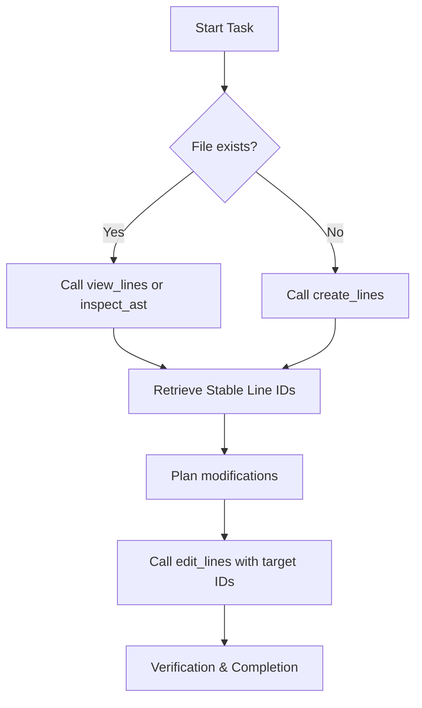

# ast-editor

`ast-editor` is an agent-native tool suite designed to enable AI coding assistants to view, inspect, and modify codebases with absolute precision and safety. By combining Tree-sitter AST queries with a session-based transactional line editor, it eliminates common editing failure modes like line-sliding hallucinations and duplicate match corruption.

---

## 🌟 Core Value Proposition

When agentic workflows attempt to edit code using traditional string-replacement tools (like `replace_file_content`), they suffer from:
1. **Line-sliding Hallucinations**: Modifying a block of code shifts the line numbers, causing subsequent edits in the same session to target the wrong lines.
2. **Brittle Matching**: Find-and-replace rules fail or match duplicate blocks when editing common or generic lines.
3. **Token Waste**: Dumping thousands of lines to edit a small function wastes context windows and tokens.

`ast-editor` solves this by introducing:
*   **Shift-Invariant targeting**: A session-cached database maps every line to a stable sequence ID and content hash (`[id, n, content]`). Line IDs remain valid even when surrounding lines are added, deleted, or shifted.
*   **Safe Paragraph/Block-level Edits**: Instead of writing complex regex, agents edit code using target anchors with transactional rollbacks.
*   **Multi-layered Safety Guards**: Automatic 800-line limits, 45KB response size caps, and 2048-character line truncations prevent token exhaustion.

---

## 🛠️ MCP Tool Suite

### 1. `create_lines`
Creates a brand-new file with initial content, JIT-initializes its database editing session, and returns the line list with unique line IDs in a single atomic step.
*   **Safety**: Fails with `FILE_ALREADY_EXISTS` if the target path is not empty.

#### Input Schema
{{create_lines_schema}}

#### Live Outputs

##### Default Output (`return_ids = false`)
{{create_lines_output_default}}

##### Output with Line IDs (`return_ids = true`)
{{create_lines_output_ids}}

#### 🛡️ Catastrophic Truncation Prevention / Why not `write_lines`

Lazy agents often try to rewrite whole files to apply simple changes. When a network hiccup or token limit is reached mid-stream, it causes catastrophic mid-file truncation and permanent data loss.

To prevent this, `create_lines` intentionally blocks overwriting (`FILE_ALREADY_EXISTS`) to act as a safety guardrail forcing surgical line-level edits (`edit_lines`) for existing files.

We do not rename `create_lines` to `write_lines` because the word "write" suggests overwriting or rewriting existing content, whereas `create_lines` is explicitly designed as a one-time creation/initialization operation.

### 2. `view_lines`
Retrieves a range of lines for any text file along with their persistent line IDs.
*   **Capping**: Range length is capped at 800 lines max per call.
*   **Capacity Limit**: Cumulative returned text is capped at 45,000 bytes.
*   **Truncation**: Lines exceeding 2048 characters are truncated in the view and given a `#TRUNC` ID suffix.

#### Input Schema
{{view_lines_schema}}

#### Live Outputs

##### Default Output (`only_ids = false`)
{{view_lines_output_default}}

##### Output with IDs Only (`only_ids = true`)
{{view_lines_output_only_ids}}

### 3. `edit_lines`
Applies a transactional batch of operations to lines using their unique IDs.
*   **Supported Operations**: `insert_before`, `insert_after`, `update`, `delete`, `move`, `replace_range`.
*   **Syntax Validation**: Performs AST parsing validation for supported languages and automatically rolls back changes if syntax errors are introduced.
*   **Safety**: Reject edits to `#TRUNC` lines with a `LINE_TOO_LONG_ERROR` recommending beautifiers (prettier, black, cargo fmt) to prevent data loss.

#### Input Schema
{{edit_lines_schema}}

#### Live Outputs

##### Compact Output
{{edit_lines_output_compact}}

### 4. `inspect_ast`
Queries a file's structure using Tree-sitter S-expression query patterns or templates (`functions`, `classes`, `imports`), returning target line ranges and definitions.

### 5. `dump_ast`
Dumps the complete AST syntax tree of a file as S-expression text up to a certain depth.

---

## 🔄 Recommended Workflow (Agent Lifecycle)



### Long Line Handling
If a line length exceeds 2048 characters and triggers a `LINE_TOO_LONG_ERROR`, run a local formatter to break it into multiple lines before editing:
$$\text{Prettier / Black / Cargo fmt} \rightarrow \text{view\_lines} \rightarrow \text{edit\_lines}$$

---

## ⚙️ Build & Setup

### Requirements
*   Rust 1.74.1+
*   Cargo

### Compilation
```bash
cargo build --release
```
The compiled release binary is located at `target/release/ast-editor`.
