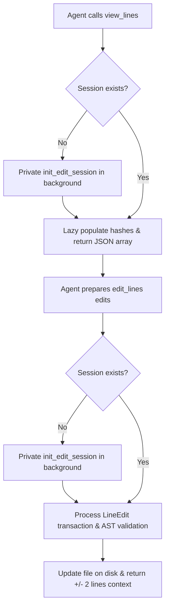

# Design Spec: ast-editor Simplification & Cognitive Improvements

We will simplify the model context protocol (MCP) tool design of the `ast-editor` plugin by removing the explicitly required initialization step, renaming session-focused tools, implementing JIT (Just-In-Time) database session caching, and absorbing `prepend`/`append` operations. This eliminates agent cognitive barriers (such as Naming Bias, Learned Helplessness, and Complexity) and lowers the entry barrier for line-level editing on all text files (including markdown and plain text).

---

## 1. Objectives

- **Reduce Complexity**: Drop the line-editing workflow from 3 steps (`init_edit_session` -> `view_session_lines` -> `apply_line_edits`) to a 2-step flow (`view_lines` -> `edit_lines`).
- **Remove Concept of "Session"**: Remove `init_edit_session` from the exposed tools. Rename `view_session_lines` to `view_lines` and `apply_line_edits` to `edit_lines` to create a symmetric, standard pair of tools.
- **Absorb Prepend & Append**: Absorb `prepend` and `append` into `insert_before` and `insert_after` respectively by omitting the `target_id`. This reduces the operation enum size and simplifies the API surface.
- **Support All Text Files**: Ensure agents naturally understand that the tools support Markdown, plain text, and configuration files. Change warnings to be highly encouraging.

---

## 2. Proposed Changes

### Tool Lineup Adjustment
1. **Remove `init_edit_session` Tool**:
   - Remove its MCP schema definition and registration.
   - Retain the inner implementation function `init_edit_session` inside `src/tools/session_db.rs` to serve as a private helper for JIT session caching.
2. **Rename `view_session_lines` to `view_lines`**:
   - Update `src/tools/view.rs` and its registration.
   - If the requested file doesn't have an active SQLite session, `view_lines` will automatically call the private `init_edit_session` function in the background before querying and returning lines.
3. **Rename `apply_line_edits` to `edit_lines`**:
   - Update `src/tools/edit.rs` and its registration.
   - If called directly on a file without an active session (e.g. for prepending/appending operations), `edit_lines` will automatically call the private `init_edit_session` function in the background.

### LineEdit Operations Schema Simplification
Simplify the `op` enum in `edit_lines` to: `["update", "insert_after", "insert_before", "delete", "replace_range", "move"]`.

- `insert_before`: Inserts content before the line specified by `target_id`. If `target_id` is omitted/null, it prepends content to the top of the file.
- `insert_after`: Inserts content after the line specified by `target_id`. If `target_id` is omitted/null, it appends content to the end of the file.
- `update`: Replaces the content of the target line.
- `delete`: Deletes the target line.
- `replace_range`: Replaces a range of lines.
- `move`: Moves a line or a block of lines to a new position.

*Note: For the `move` operation, `move_position` can still accept `"prepend"` or `"append"` (to move a block to the top/end of the file) in addition to `"before"` or `"after"` destination line.*

### JIT Session Caching
- **`view_lines`**: Auto-initializes the database session for the file when called if no session is active.
- **`edit_lines`**: Auto-initializes the database session for the file when called if no session is active.

### Schema Descriptions & Warning Messages
- **Descriptions**:
  - `view_lines`: `"Retrieves lines along with their persistent unique Line IDs for any text file (including markdown or plain text). Useful for target line selection."`
  - `edit_lines`: `"Applies a structured batch of line edits (insert_after, insert_before, update, delete, replace_range, move) transactionally to any text file. Performs syntax validation for supported programming languages."`
- **Warning Message (on unsupported formats)**:
  - `"This file type is not supported for AST syntax validation. However, you can still view and edit it safely using line-level editing tools (view_lines and edit_lines). All line sequence IDs are fully active!"`

---

## 3. Data Flow

