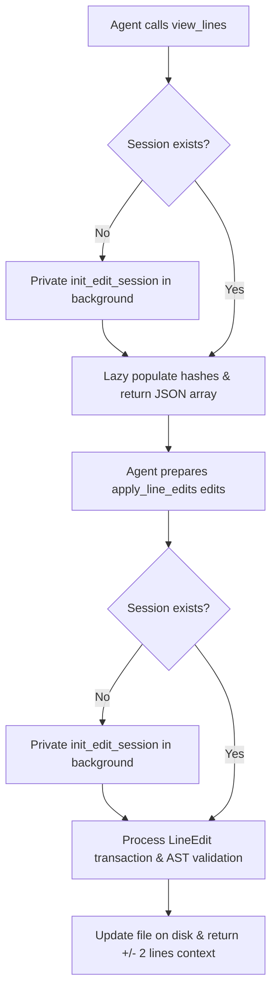

# Design Spec: ast-editor Simplification & Cognitive Improvements

We will simplify the model context protocol (MCP) tool design of the `ast-editor` plugin by removing the explicitly required initialization step, renaming session-focused tools, and implementing JIT (Just-In-Time) database session caching. This eliminates agent cognitive barriers (such as Naming Bias, Learned Helplessness, and Complexity) and lowers the entry barrier for line-level editing on all text files (including markdown and plain text).

---

## 1. Objectives

- **Reduce Complexity**: Drop the line-editing workflow from 3 steps (`init_edit_session` -> `view_session_lines` -> `apply_line_edits`) to a 2-step flow (`view_lines` -> `apply_line_edits`).
- **Remove Concept of "Session"**: Remove `init_edit_session` from the exposed tools. Rename `view_session_lines` to `view_lines` to mimic standard file viewing.
- **Support All Text Files**: Ensure agents naturally understand that the tools support Markdown, plain text, and configuration files. Change warnings to be highly encouraging.

---

## 2. Proposed Changes

### Tool Lineup Adjustment
1. **Remove `init_edit_session` Tool**:
   - Remove its MCP schema definition and registration.
   - Retain the inner implementation function `init_edit_session` inside `src/tools/session_db.rs` to serve as a private helper for JIT session caching.
2. **Rename `view_session_lines` to `view_lines`**:
   - Update `src/tools/view.rs` and its registration.
   - If the requested file doesn't have an active SQLite session, `view_lines` will automatically call the private `init_edit_session` function in the background before querying and returning lines.

### JIT Session Caching
- **`view_lines`**: Auto-initializes the database session for the file when called if no session is active.
- **`apply_line_edits`**: If called directly on a file without an active session (e.g. for `prepend`/`append` operations), auto-initializes the session privately.

### Schema Descriptions & Warning Messages
- **Descriptions**:
  - `view_lines`: `"Retrieves lines along with their persistent unique Line IDs for any text file (including markdown or plain text). Useful for target line selection."`
  - `apply_line_edits`: `"Applies a structured batch of line edits (insert_after, insert_before, append, prepend, update, delete, replace_range, move) transactionally to any text file. Performs syntax validation for supported programming languages."`
- **Warning Message (on unsupported formats)**:
  - `"This file type is not supported for AST syntax validation. However, you can still view and edit it safely using line-level editing tools (view_lines and apply_line_edits). All line sequence IDs are fully active!"`

---

## 3. Data Flow

